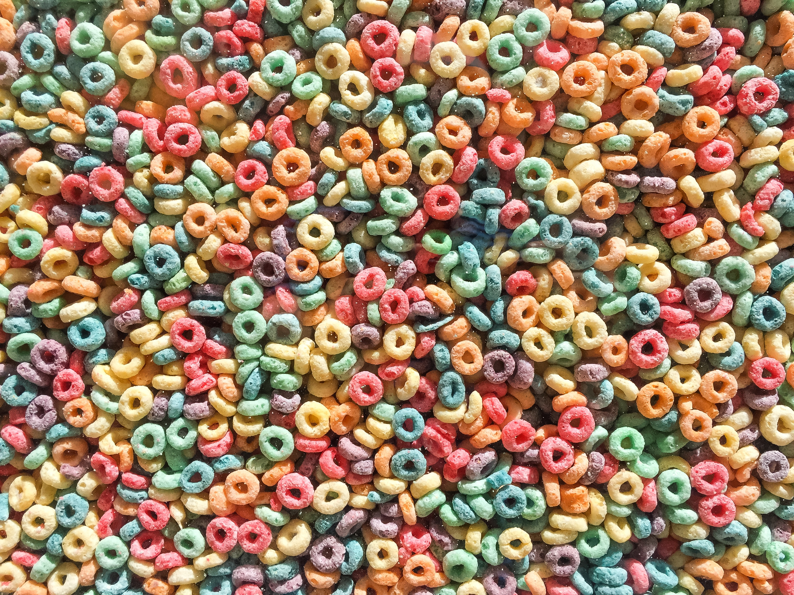
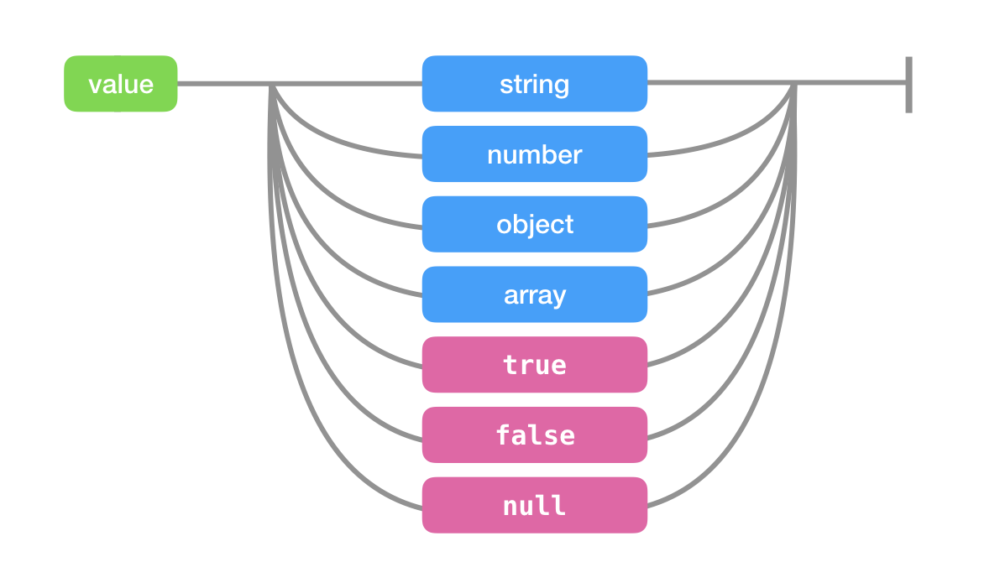
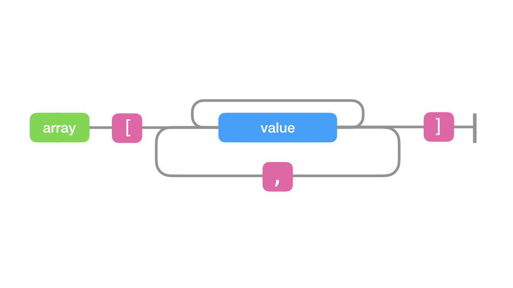
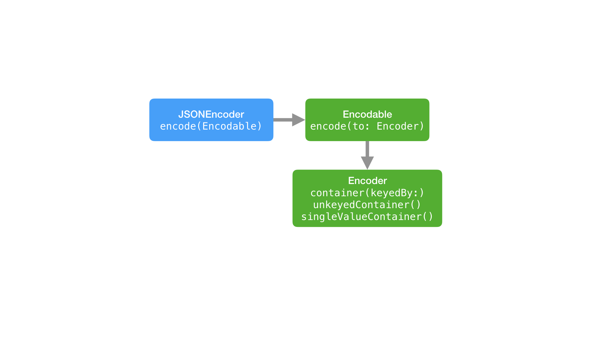
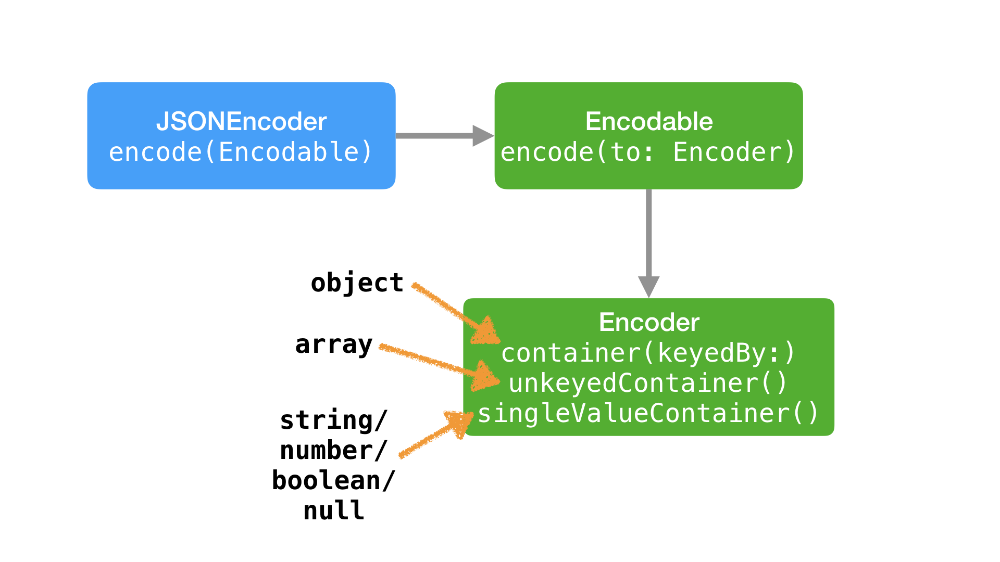

#[fit] _Decoding_
#[fit] Codable

---


---


#[fit] @iwantmyrealname
#[fit] github.com/sammyd

---


#[fit] __serialisation__

---


> serialisation is the process of translating data structures or object state into a format that can be stored or transmitted and reconstructed later.
> -- Wikipedia, obvs

---

# JSON

```json
{
  "name": "2D Apple Games by Tutorials",
  "sku": "igt1",
  "image_url": "\/a725405c-a26a-4974-bcb0-d7fdef766f99.png",
  "url": "\/products\/2d-apple-games-by-tutorials"
}
```

# Swift
```swift
struct Product {
  let name: String
  let image_url: URL?
  let url: URL?
  let sku: String
}
```

---

#[fit] __dynamic__
#[fit] languages

---

#[fit] _can_ construct
#[fit] model objects
#[fit] at __runtime__

---

# Ruby

```ruby
product = JSON.parse(json_string,
                     object_class: OpenStruct)
```

---

#[fit] _or_ you can use
#[fit] __introspection__
#[fit] \(reflection\)

---

#[fit] __static__
#[fit] languages

---

#[fit] __introspection__
#[fit] still an option

---

# C♯

```cs
Product deserializedProduct =
  JsonConvert.DeserializeObject<Product>(jsonString);
```

---

#[fit] reflection in
#[fit] __Swift__ isn't as
#[fit] _powerful_

---

# Naïve Parsing[^1]

```swift
var repos = [Repo]()

if let json : AnyObject = json {
  if let array = json as? NSArray {
    for jsonItem in array as [AnyObject] {
      if let id = jsonItem.valueForKey("id") as? Int {
        if let name = jsonItem.valueForKey("name") as? String {
          if let url_string = jsonItem.valueForKey("url") as? String {
            if let fork = jsonItem.valueForKey("fork") as? Bool {
              if let url = NSURL(string: url_string) {
                let description = jsonItem.valueForKey("description") as? String
                var homepage: NSURL? = .None
                if let homepage_string = jsonItem.valueForKey("homepage") as? String {
                  homepage = NSURL(string: homepage_string)
                }
                let repo = Repo(id: id, name: name, desc: description, url: url,
                                homepage: homepage, fork: fork)
                repos += [repo]
              }
            }
          }
        }
      }
    }
  }
}
```

[^1]: This Swift is 2.5 years old

---

# SwiftyJSON[^2]

```swift
let json = JSON(data: rawJSON!, options: .allZeros, error: nil)

var repos = [Repo]()
for (index: String, subJson: JSON) in json {
  if let id = subJson["id"].int,
     let name = subJson["name"].string,
     let url = subJson["url"].string,
     let fork = subJson["fork"].bool {
        var homepage: NSURL? = .None
        if let homepage_raw = subJson["homepage"].string {
          homepage = NSURL(string: homepage_raw)
        }
        let url_url = NSURL(string: url)!
        repos += [Repo(id: id, name: name, desc: subJson["description"].string,
          url: url_url, homepage: homepage, fork: fork)]
  }
}
```

[^2]: It's from a blog I wrote about different JSON parsing options in Swift.

---

# Argo[^3]

```swift
extension Repo: JSONDecodable {
  static func create(id: Int)(name: String)(desc: String?)
                    (url: NSURL)(homepage: NSURL?)(fork: Bool) -> Repo {
    return Repo(id: id, name: name, desc: desc,
                url: url, homepage: homepage, fork: fork)
  }
  
  static func decode(j: JSON) -> Repo? {
    return Repo.create
      <^> j <|  "id"
      <*> j <|  "name"
      <*> j <|? "description"
      <*> j <|  "url"
      <*> j <|? "homepage"
      <*> j <|  "fork"
  }
}

let repos: [Repo]? = (JSONValue.parse <^> json) >>- decodeArray
```

[^3]: Don't use any of them. Read the blog here: [http://blog.scottlogic.com/2015/03/09/json-in-swift.html](http://blog.scottlogic.com/2015/03/09/json-in-swift.html).

---

#[fit] _enter_
#[fit] __`Codable`__

---

#[fit] compiler
#[fit] __generated__
#[fit] extensions

---

# [fit] 1.

---

# [fit] 1. adopt
# [fit] `Codable`
# [fit] protocol

---

# [fit] 2.

---

# [fit] 2. done!
# [fit] _(probably)_

---

# [fit] _demo_

---

#[fit] __JSON__

---



---



---


---

#[fit] _demo_

---
# Encodable

```swift
public protocol Encodable {
  public func encode(to encoder: Encoder) throws
}

```

---

# Encoder

```swift
public protocol Encoder {
  ....
  public func container<Key>(keyedBy type: Key.Type) ->
    KeyedEncodingContainer<Key> where Key : CodingKey
  public func unkeyedContainer() -> UnkeyedEncodingContainer
  public func singleValueContainer() -> SingleValueEncodingContainer
}
```

---


---


---



---



---


# Decodable

```swift
public protocol Decodable {
  public init(from decoder: Decoder) throws
}
```

---

# Decoder

```swift
public protocol Decoder {
  ...
  public func container<Key>(keyedBy type: Key.Type) throws ->
    KeyedDecodingContainer<Key> where Key : CodingKey
  public func unkeyedContainer() throws -> UnkeyedDecodingContainer
  public func singleValueContainer() throws -> SingleValueDecodingContainer
}
```

---

#[fit] _demo_

---

#[fit] __unlike__ other
#[fit] iOS 11
#[fit] _guff_...

---

#[fit] you can
#[fit] _use_ this
#[fit] __NOW__

---

#[fit] _well, once_
#[fit] _you migrate_
#[fit] _to_ __Swift 4__

---

#[fit] i _like_ it.
#[fit] you should
#[fit] __try__ it.

---

# Some Links from Clever People

+ [swiftunboxed.com/stdlib/json-encoder-encodable/](https://swiftunboxed.com/stdlib/json-encoder-encodable/)
+ [swiftunboxed.com/stdlib/json-decoder-decodable/](https://swiftunboxed.com/stdlib/json-decoder-decodable/)
+ [mikeash.com/pyblog/friday-qa-2017-07-14-swiftcodable.html](https://mikeash.com/pyblog/friday-qa-2017-07-14-swiftcodable.html)
+ [mikeash.com/pyblog/friday-qa-2017-07-28-a-binary-coder-for-swift.html](https://mikeash.com/pyblog/friday-qa-2017-07-28-a-binary-coder-for-swift.html)
+ [lists.swift.org/pipermail/swift-evolution/Week-of-Mon-20170731/038522.html](https://lists.swift.org/pipermail/swift-evolution/Week-of-Mon-20170731/038522.html)

---

#[fit] [github.com/sammyd](https://github.com/sammyd/iOSConfSG2017_Codable)
#[fit] [/iOSConfSG2017_Codable](https://github.com/sammyd/iOSConfSG2017_Codable)
#[fit] —
#[fit] [@iwantmyrealname](https://twitter.com/iwantmyrealname)

